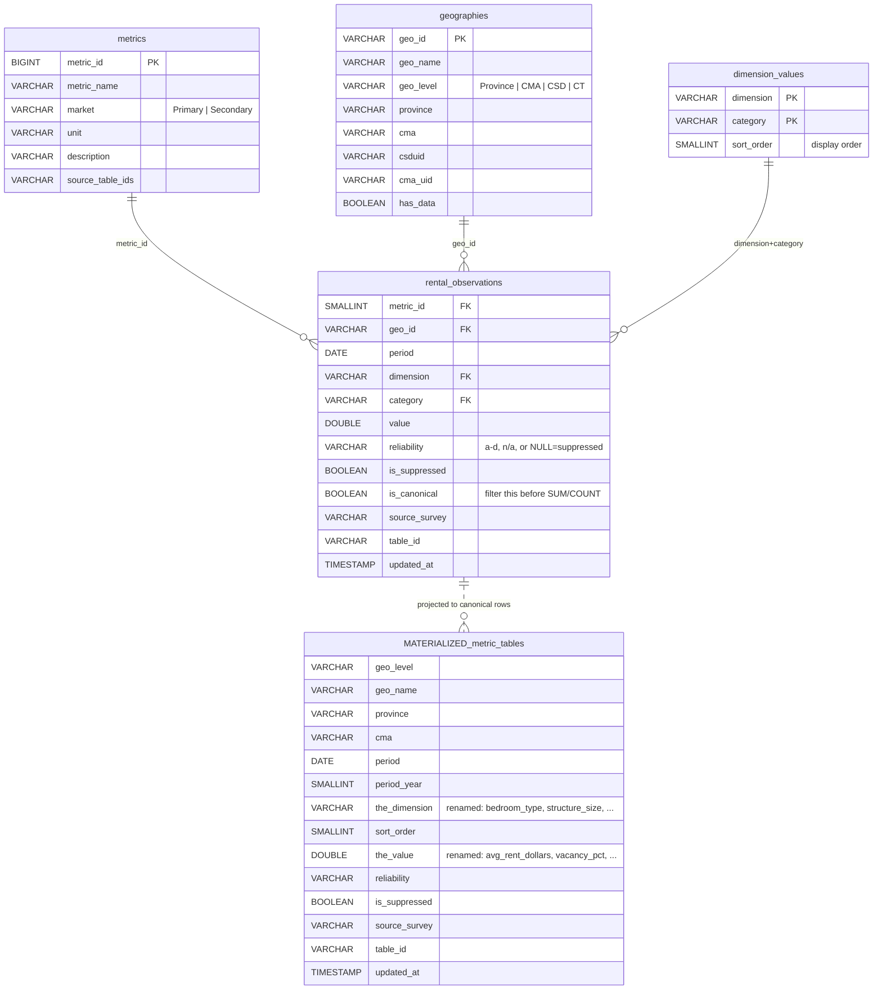

# CMHC Rental Data Mart — User Guide

A task-oriented guide to querying `data/marts/cmhc_rental.duckdb`. For the full schema
reference and column conventions, see [DATAMART.md](../../docs/DATAMART.md); this doc is the
"how do I actually get X" companion, organized by what you're trying to do.

## Opening the file

```bash
# DuckDB CLI
duckdb data/marts/cmhc_rental.duckdb

# or Python
python -c "import duckdb; con = duckdb.connect('data/marts/cmhc_rental.duckdb', read_only=True)"
```

Everything below is plain SQL — paste it into the CLI or pass it to `con.execute(...)`.

---

## The shape of the data (1-minute orientation)

Two layers in one file:

- **Materialized metric tables** (25 of them) — flat, denormalized, one per
  `{metric}_by_{dimension}` (e.g. `average_rent_by_bedroom`). Geography pre-joined,
  deduplicated, ready to chart. **Use these for ~80% of questions.**
- **Star core** (`rental_observations` + 3 dim tables) — the long fact everything
  is built from. Drop here only when no metric table fits (multi-metric pivots,
  unusual cross-sections, joining external data).



`_meta` (not shown) is a single-row provenance/coverage table with no relationships.

---

## Discover what's available

**What metrics exist?**

```sql
SELECT metric_name, market, unit, description
FROM   metrics
ORDER BY market, metric_name;
```

**What tables can I query?** Names follow `{metric}_by_{dimension}`:

```sql
SELECT table_name
FROM   information_schema.tables
WHERE  table_schema = 'main'
ORDER BY table_name;
```

**What values can a dimension take, in display order?**

```sql
SELECT category, sort_order
FROM   dimension_values
WHERE  dimension = 'Bedroom Type'
ORDER BY sort_order;
```

---

## Cookbook

### Rank geographies by the latest value (the most common query)

The materialized tables are deduplicated, so this is just a filter + sort — no
window function needed.

```sql
SELECT geo_name, period, avg_rent_dollars, reliability
FROM   average_rent_by_bedroom
WHERE  geo_level    = 'CMA'
  AND  bedroom_type = '2 Bedroom'
  AND  period_year  = 2025
ORDER BY avg_rent_dollars DESC;
```

### Time series for one geography

```sql
SELECT period, vacancy_pct, reliability
FROM   vacancy_rate_by_bedroom
WHERE  geo_name     = 'Toronto'
  AND  bedroom_type = 'Total'
ORDER BY period;
```

### A full breakdown in logical order (not alphabetical)

`ORDER BY sort_order` gives `Studio → 1 → 2 → 3+ → Total`; ordering by the label
would scramble it.

```sql
SELECT bedroom_type, avg_rent_dollars
FROM   average_rent_by_bedroom
WHERE  geo_name    = 'Ottawa'
  AND  period_year = 2025
ORDER BY sort_order;
```

### High-confidence values only

Reliability runs `'a'` (best) → `'d'`. Tables that carry no rating use `'n/a'`;
`NULL` means suppressed. So this keeps only well-measured cells:

```sql
SELECT geo_name, avg_rent_dollars, reliability
FROM   average_rent_by_bedroom
WHERE  geo_level    = 'CSD'
  AND  bedroom_type = '2 Bedroom'
  AND  period_year  = 2025
  AND  reliability IN ('a','b')
ORDER BY avg_rent_dollars DESC;
```

> Watch out: `reliability IN ('a','b')` also excludes `'n/a'` rows (universe counts,
> rent change) — those metrics simply aren't rated, not low quality. Drop the
> reliability filter for those.

### Check suppression before aggregating

A missing value (`**` from CMHC) is `is_suppressed = TRUE`. Never treat it as zero.

```sql
-- How much of a slice is suppressed?
SELECT
    count(*)                              AS cells,
    count(*) FILTER (WHERE is_suppressed) AS suppressed,
    round(100.0 * count(*) FILTER (WHERE is_suppressed) / count(*), 1) AS pct_suppressed
FROM   average_rent_by_bedroom
WHERE  geo_level = 'CT' AND bedroom_type = '2 Bedroom' AND period_year = 2025;
```

### Census-tract detail within one metro

CT rental is heavily suppressed, so filter on reliability before ranking.

```sql
SELECT geo_name, avg_rent_dollars, reliability
FROM   average_rent_by_bedroom
WHERE  geo_level    = 'CT'
  AND  cma          = 'Toronto'
  AND  bedroom_type = '2 Bedroom'
  AND  period_year  = 2025
  AND  reliability IN ('a','b')
ORDER BY avg_rent_dollars DESC;
```

### Primary vs secondary (condo) rent, side by side

```sql
SELECT r.period,
       r.avg_rent_dollars       AS primary_2br,
       s.avg_rent_dollars       AS condo_2br
FROM       average_rent_by_bedroom       r
LEFT JOIN  condo_average_rent_by_bedroom s
       ON  s.geo_name = r.geo_name AND s.period = r.period
      AND  s.bedroom_type = r.bedroom_type
WHERE  r.geo_name = 'Toronto' AND r.bedroom_type = '2 Bedroom'
ORDER BY r.period;
```

### Sum or count from the star — filter `is_canonical` first

The star keeps every CMHC publication path, so the same value can appear 2–5×.
For SUM/COUNT you **must** restrict to one row per cell:

```sql
SELECT g.geo_name, round(sum(o.value)) AS total_units
FROM   rental_observations o
JOIN   metrics      m USING (metric_id)
JOIN   geographies  g USING (geo_id)
WHERE  m.metric_name = 'Rental Universe'
  AND  o.dimension   = 'Bedroom Type'
  AND  o.category    = 'Total'
  AND  g.geo_level   = 'CMA'
  AND  extract(year FROM o.period) = 2025
  AND  o.is_canonical            -- <-- without this, totals are ~3x too high
GROUP BY g.geo_name
ORDER BY total_units DESC;
```

(The materialized tables are already canonical-only, so this caveat is star-specific.)

### Combine metrics the materialized layer doesn't pre-bake

```sql
SELECT g.geo_name, m.metric_name, o.value
FROM   rental_observations o
JOIN   metrics      m USING (metric_id)
JOIN   geographies  g USING (geo_id)
WHERE  g.geo_name  = 'Hamilton'
  AND  o.dimension = 'Bedroom Type'
  AND  o.category  = '2 Bedroom'
  AND  extract(year FROM o.period) = 2025
  AND  m.metric_name IN ('Vacancy Rate','Average Rent','Rental Universe')
  AND  o.is_canonical
ORDER BY m.metric_name;
```

### Cross-reference the source HMIP table

```sql
SELECT DISTINCT table_id, source_survey
FROM   average_rent_by_bedroom
WHERE  geo_name = 'Toronto';
-- View on the web: .../TableMapChart/Table?TableId=<table_id>&GeographyId=35&GeographyTypeId=2
```

### How fresh / where did this come from

```sql
SELECT * FROM _meta;                              -- coverage + provenance, one row

SELECT max(updated_at) AS freshest,              -- per-archive refresh times
       min(updated_at) AS stalest
FROM   rental_observations;
```

---

## Gotchas cheat-sheet

| If you… | …do this |
|---|---|
| SUM/COUNT over the **star** | add `WHERE is_canonical` |
| SUM/COUNT over a **materialized table** | nothing — already deduplicated |
| Want logical category order | `ORDER BY sort_order`, not the label |
| Filter high-confidence | `reliability IN ('a','b')` — but it drops unrated `'n/a'` metrics |
| See a missing value | check `is_suppressed`; don't treat as 0 |
| `reliability IS NULL` | means suppressed (and only that) |
| Need a level | filter `geo_level IN ('Province','CMA','CSD','CT')` |
| Join external StatCan data | join on `csduid` / `cma_uid`, not names |
| Latest reading | `period_year = 2025` is usually it, but sparse geos lag — confirm with `MAX(period)` per geo |

---

## What's not here

Ontario only; Rms + Srms only; CMHC source data only (no forecasts, no MMAH/StatCan
folded in, no boundary polygons). See [DATAMART.md](../../docs/DATAMART.md) "What's NOT in the
file" for the full list and the rebuild procedure.
</content>
